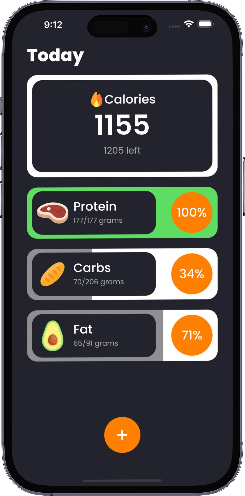

# Calorico   
## _Easy and Intuitive Nutrition Tracking App_

## Main Features
- Track daily Calories, Protein, Carbohydrates, and Fats
- Conveniently add food via a barcode scan 
- Search an extensive database of food/drink with nutrition info
- Quickly log food with the custom add feature
- Stores all searches and added foods for later use

## Screenshots

